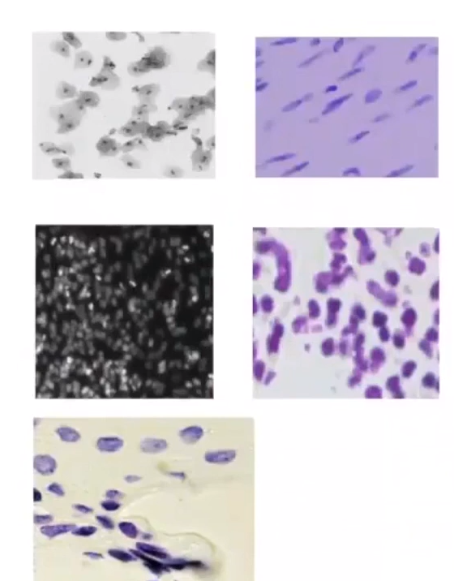
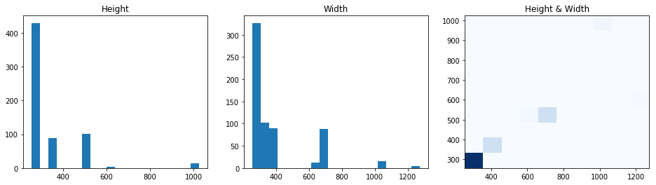
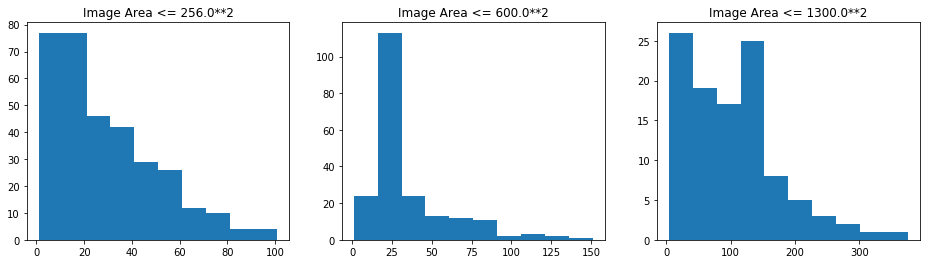
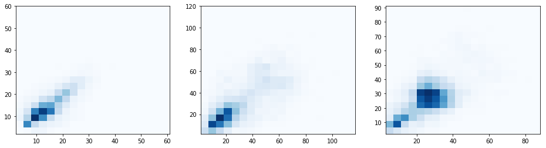
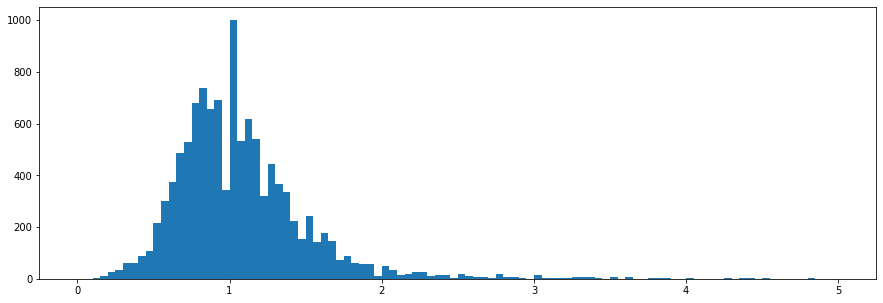

# Nuclei Counting and Segmentation--Mask R-CNN

本项目是用Mask R-CNN来解决 [kaggle 2018 数据科学碗](https://www.kaggle.com/c/data-science-bowl-2018).

## 一、数据探索

### 1、数据集说明

该数据集包含大量分段的核图像。图像是在各种条件下采集的，并且在细胞类型，放大率和成像方式（明场与荧光）方面有所不同。该数据集旨在挑战算法概括这些变化的能力。
每个图像都由一个关联的表示`ImageId`。属于图像的文件包含在此文件夹中`ImageId`。此文件夹中有两个子文件夹：

- images文件夹：包含图像文件。
- masks文件夹：包含每个核的分段mask。此文件夹仅包含在训练集中。每个mask包含一个核。mask不允许重叠（没有像素属于两个mask）。

**数据文件夹如下**

```latex
|-- datasets
    |-- nucleus
         |--- stage1_train
              |-- imageID
                    |-- images
                    |--- masks
         |-- stage1_test
              |-- imageID
                    |-- images
                    |--- masks
```

### 2、探索数据

#### 1).数据集初步探索

- 1.图片从颜色大致可分为5类

```latex
黑前景，白背景
紫前景，紫背景
白前景，黑背景
紫前景，白背景
紫前景，黄背景
```


| 文件来源           | 前景 | 背景 | 个数 |
| ------------------ | ---- | ---- | ---- |
| stage1_train       | 黑   | 白   | 16   |
| stage1_train       | 紫   | 紫   | 70   |
| stage1_train       | 紫   | 白   | 38   |
| stage1_train       | 白   | 黑   | 546  |
| stage1_train  汇总 |      |      | 670  |
| stage1_test        | 紫   | 紫   | 1    |
| stage1_test        | 紫   | 白   | 3    |
| stage1_test        | 紫   | 黄   | 8    |
| stage1_test        | 白   | 黑   | 53   |
| stage1_test 汇总   |      |      | 65   |
| 总计               |      |      | 735  |

- 2.数据存在的问题
  - 有些细胞核的mask图片，出现了不该有中空的孔洞
  - 有些图片有alpha通道
  - 有些图片的mask是错误的
- 2.训练集、验证集和测试集划分
  - stage1_train（670张）

  - stage1_test（65张）

#### 2).数据集的一些统计数据   

##### 1.图片尺寸统计



```
Image Count:  639
  Height  mean: 332.27  median: 256.00  min: 256.00  max: 1024.00
  Width   mean: 373.72  median: 256.00  min: 256.00  max: 1272.00
  Color   mean (RGB): 41.55 37.83 46.13
```

##### 2.每张图的细胞核统计    

 

```
Nuclei/Image
  Image area <=  256**2:  mean: 28.7  median: 22.0  min: 1.0  max: 101.0
  Image area <=  600**2:  mean: 34.5  median: 25.0  min: 1.0  max: 151.0
  Image area <= 1300**2:  mean: 103.0  median: 101.0  min: 4.0  max: 375.0
```


##### 3.细胞核尺寸统计  

    


```
 Image Area <= 256**2
    Total Nuclei:  9383
    Nucleus Height. mean: 14.14  median: 13.00  min: 2.00  max: 60.00
    Nucleus Width.  mean: 14.37  median: 13.00  min: 2.00  max: 61.00
    Nucleus Area.   mean: 231.92  median: 168.00  min: 24.00  max: 2880.00

  Image Area <= 600**2
    Total Nuclei:  7078
    Nucleus Height. mean: 28.65  median: 23.00  min: 2.00  max: 120.00
    Nucleus Width.  mean: 29.74  median: 24.00  min: 1.00  max: 117.00
    Nucleus Area.   mean: 1094.10  median: 546.00  min: 21.00  max: 13560.00

  Image Area <= 1300**2
    Total Nuclei:  11023
    Nucleus Height. mean: 25.89  median: 26.00  min: 2.00  max: 91.00
    Nucleus Width.  mean: 25.91  median: 26.00  min: 3.00  max: 88.00
    Nucleus Area.   mean: 751.73  median: 693.00  min: 21.00  max: 5120.00
```

 

```
Nucleus Aspect Ratio.  mean: 1.09  median: 1.00  min: 0.02  max: 57.00
```


#### 3).数据增广   

- 1.翻转、旋转和高斯模糊等
```python
    augmentation = iaa.SomeOf((0, 2), [
        iaa.Fliplr(0.5),
        iaa.Flipud(0.5),
        iaa.OneOf([iaa.Affine(rotate=90),
                   iaa.Affine(rotate=180),
                   iaa.Affine(rotate=270)]),
        iaa.Multiply((0.8, 1.5)),
        iaa.GaussianBlur(sigma=(0.0, 5.0))
    ])
```

- 2.剪裁

- 3.迷你Masks

### 3、数据预处理和模型修改

#### 1.数据处理

- 因为原始数据集有一些错误，使用[非官方的数据集的修改版本](https://github.com/lopuhin/kaggle-dsbowl-2018-dataset-fixes)。

- 本项目不使用与数据源类似的细胞核数据集作为外部数据集。

#### 2.根据数据集数据探索对模型进行修改

```python
IMAGE_MIN_DIM = 640
IMAGE_MAX_DIM = 640

#在制作样本标签时，从一张图片最多只读取多少个实例
MAX_GT_INSTANCES = 380
```


## 二、训练

1. Train a new model starting from COCO weights using `train` dataset (which is `stage1_train` minus validation set).（训练集是stage1_train的670张，减去手动设置的25张验证集图片后的645张图片）。

```python
python nucleus.py train --dataset=/path/to/dataset --subset=train --weights=coco
```

2. Train a new model starting from specific weights file using the full `stage1_train` dataset.（训练集是整个stage1_train的670张）。

```python
python nucleus.py train --dataset=/path/to/dataset --subset=stage1_train --weights=/path/to/weights.h5
```

3. Resume training a model that you had trained earlier.（接着之前的训练继续训练）。

```python
python nucleus.py train --dataset=/path/to/dataset --subset=train --weights=last
```

4. Generate submission file from `stage1_test` images.（用stage1_test的图片生成提交文件）。

```python
python nucleus.py detect --dataset=/path/to/dataset --subset=stage1_test --weights=<last or /path/to/weights.h5>
```

